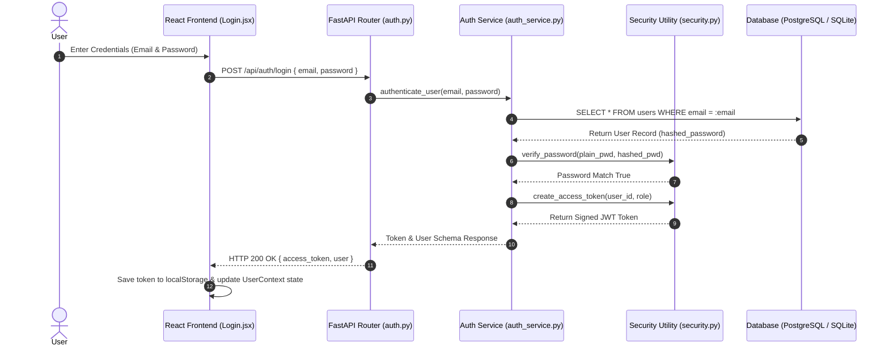
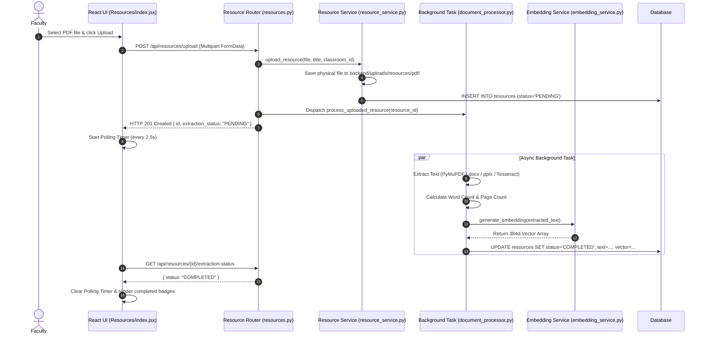
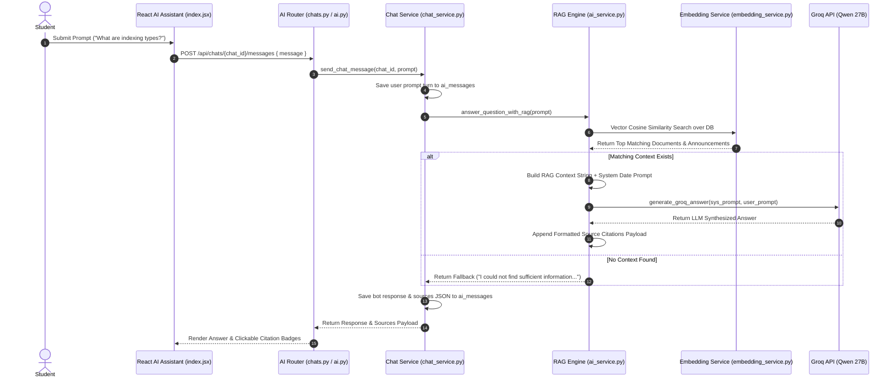

# Acadrium - Production Codebase Audit & Complete Viva Handbook

Welcome to the **Acadrium Academic Memory System** Codebase Audit & Comprehensive Viva Handbook. This document contains a 100% code-verifiable analysis of every directory, file, component, API endpoint, database model, business logic service, flow diagram, and expected viva review question.

---

# PHASE 1 - PROJECT DISCOVERY

## 1. Directory & File Structure

```
Acadrium/
├── .env.example                      # Root environment variable template
├── .gitignore                        # Git exclusion rules
├── .oxlintrc.json                    # Code linter configuration
├── index.html                        # Vite HTML mount entry point
├── package.json                      # Frontend dependencies & scripts
├── package-lock.json                 # Locked node_modules dependency tree
├── vite.config.js                    # Vite dev server & proxy configuration
├── README.md                         # Quick start documentation
├── REVIEW_GUIDE.md                   # Complete viva & code audit handbook
│
├── public/                           # Public static web assets
│   ├── favicon.ico
│   └── logo.png
│
├── src/                              # FRONTEND SOURCE CODE (React 19 + Vite + TailwindCSS)
│   ├── App.css                       # Application-level CSS styles
│   ├── App.jsx                       # React Root Component (wraps UserProvider & AppRoutes)
│   ├── index.css                     # Design system base utilities & tailwind imports
│   ├── main.jsx                      # DOM mount point (`ReactDOM.createRoot`)
│   │
│   ├── assets/                       # SVG icons & branding graphics
│   │
│   ├── components/                   # REUSABLE UI COMPONENTS
│   │   ├── common/
│   │   │   ├── DocumentViewer.jsx    # Multi-format preview modal (PDF, DOCX, PPTX, Image, Text + OCR/Summary)
│   │   │   └── UserContext.jsx       # React Context: Global state, auth, live status polling, toasts
│   │   └── layout/
│   │       ├── Header.jsx            # Top bar: Brand title, role badge, quick actions
│   │       ├── RightSidebar.jsx      # Global Activity Timeline widget (real-time stream)
│   │       └── Sidebar.jsx           # Main navigation drawer & role-aware page routes
│   │
│   ├── layouts/
│   │   └── AppLayout.jsx             # Shell layout wrapping Header, Sidebar, Content, & RightSidebar
│   │
│   ├── pages/                        # PAGE VIEW COMPONENTS
│   │   ├── AIAssistant/
│   │   │   └── index.jsx             # RAG AI Chat interface, persistent session sidebar & source citations
│   │   ├── Announcements/
│   │   │   └── index.jsx             # Classroom notices stream & academic date filter
│   │   ├── Classrooms/
│   │   │   ├── index.jsx             # Faculty classroom creator & student classroom joiner grid
│   │   │   └── Details.jsx           # Classroom dashboard: Resources, announcements, student roster
│   │   ├── Dashboard/
│   │   │   └── index.jsx             # Main dashboard analytics, upcoming academic dates & quick stats
│   │   ├── Login/
│   │   │   └── index.jsx             # User authentication login form with role toggle
│   │   ├── Profile/
│   │   │   └── index.jsx             # User profile details editor (Department, Semester, Password)
│   │   ├── Register/
│   │   │   └── index.jsx             # User account registration form
│   │   ├── Resources/
│   │   │   └── index.jsx             # Centralized course resources library, upload modal & search
│   │   └── Workspace/
│   │       └── index.jsx             # Personal private cloud drive & rich text study notes editor
│   │
│   ├── routes/
│   │   └── AppRoutes.jsx             # React Router v6 route configuration & Auth Guards (`ProtectedRoute`, `PublicOnlyRoute`)
│   │
│   ├── services/
│   │   └── api.js                    # Axios/Fetch HTTP API client mapping all backend endpoints
│   │
│   ├── styles/
│   │   └── index.css                 # Custom CSS variables & component design tokens
│   │
│   └── types/
│       └── index.js                  # JSDoc type definitions for entities & state schemas
│
└── backend/                          # BACKEND SOURCE CODE (FastAPI + SQLAlchemy + Pydantic + PyMuPDF + Sentence-Transformers + Groq)
    ├── .env                          # Local environment secrets (Database URL, Secret Key, Groq API Key)
    ├── .env.example                  # Backend environment variable reference template
    ├── alembic.ini                   # Database migration configuration
    ├── reprocess_resources.py        # CLI Utility to batch-reprocess OCR, embeddings & metadata for all files
    ├── requirements.txt              # Python package dependencies
    ├── run.py                        # Uvicorn entry point script (`uvicorn app.main:app`)
    │
    ├── app/                          # Main Application Package
    │   ├── main.py                   # FastAPI app instance, CORS setup, router registrations & table creation
    │   │
    │   ├── auth/                     # Security & Token Management
    │   │   ├── dependencies.py       # Auth dependencies (`get_current_user`, `require_faculty`, `require_student`)
    │   │   └── security.py           # Bcrypt password hashing & JWT encoding/decoding utilities
    │   │
    │   ├── database/                 # Database Layer
    │   │   ├── config.py             # Pydantic BaseSettings loading `.env` variables
    │   │   ├── session.py            # Engine setup, SQLite fallback, column auto-migration & data backfills
    │   │   └── vector_type.py        # Polyfill column type (`Vector(384)` for PostgreSQL pgvector, `TEXT` for SQLite)
    │   │
    │   ├── middleware/
    │   │   └── cors.py               # Cross-Origin Resource Sharing (CORS) middleware configuration
    │   │
    │   ├── models/                   # SQLAlchemy ORM Models
    │   │   ├── __init__.py           # Package exports for Base metadata binding
    │   │   ├── user.py               # `users` model & custom GUID type decorator
    │   │   ├── classroom.py          # `classrooms` & `classroom_members` models
    │   │   ├── resource.py           # `resources` model (Classroom course files)
    │   │   ├── workspace_resource.py # `workspace_resources` model (Personal private files)
    │   │   ├── workspace_note.py     # `workspace_notes` model (Personal rich text notes)
    │   │   ├── announcement.py       # `announcements` model (Notices with academic dates)
    │   │   ├── timeline_event.py     # `timeline_events` model (System activity logs)
    │   │   └── chat.py               # `ai_chats` & `ai_messages` models (Persistent RAG chat sessions)
    │   │
    │   ├── routes/                   # FastAPI Controllers (API Routes)
    │   │   ├── __init__.py           # Package initializer
    │   │   ├── ai.py                 # RAG QA (`/api/ai/ask`) & Document Summarizer endpoints
    │   │   ├── announcements.py      # Announcement CRUD & filtering endpoints
    │   │   ├── auth.py               # User login, register, profile endpoints
    │   │   ├── chats.py              # Persistent AI Chat history CRUD endpoints
    │   │   ├── classrooms.py         # Classroom creation, membership & roster endpoints
    │   │   ├── resources.py          # Classroom document upload, preview, download & deletion endpoints
    │   │   ├── search.py             # Vector semantic search endpoints (`/api/search/resources`, `/api/search/workspace`)
    │   │   ├── timeline.py           # Global activity feed retrieval endpoint
    │   │   ├── workspace.py          # Workspace document upload, preview, download & deletion endpoints
    │   │   └── workspace_notes.py    # Personal note taking CRUD endpoints
    │   │
    │   ├── schemas/                  # Pydantic Schemas (Data Transfer Objects / Validation)
    │   │   ├── announcement.py       # Request/Response schemas for announcements
    │   │   ├── auth.py               # Auth login, register & profile schemas
    │   │   ├── classroom.py          # Classroom creation & join code schemas
    │   │   ├── resource.py           # Resource metadata schemas
    │   │   ├── workspace.py          # Workspace file schemas
    │   │   └── workspace_note.py     # Workspace note creation & update schemas
    │   │
    │   └── services/                 # Core Business Logic Services
    │       ├── ai_service.py         # RAG pipeline, context building, source attribution & fallback generator
    │       ├── announcement_service.py # Announcement broadcasting & academic date handling
    │       ├── auth_service.py       # Password verification, user creation & JWT issuance
    │       ├── chat_service.py       # Chat conversation history, auto-titling & turn persistence
    │       ├── classroom_service.py  # Invite code generation (`ACDR-XXXX-XXXX`), roster management & enrollment
    │       ├── document_processor.py # Multi-format text extraction (PDF, DOCX, PPTX, TXT, Image OCR)
    │       ├── embedding_service.py  # `sentence-transformers/all-MiniLM-L6-v2` vector generator & similarity search
    │       ├── groq_service.py       # Groq Qwen-3.8-27B LLM API connector with zero-crash fallbacks
    │       ├── resource_service.py  # Course resource disk storage & DB management
    │       ├── timeline_service.py   # Central activity logging engine (`log_timeline_event`)
    │       ├── workspace_note_service.py # Personal note storage & live word count calculation
    │       └── workspace_service.py # Personal file disk storage & DB management
    │
    └── uploads/                      # Physical Disk File Storage
        ├── resources/                # Storage subfolders (`pdf/`, `doc/`, `ppt/`, `images/`, `text/`)
        └── workspace/                # Workspace storage subfolders (`pdf/`, `doc/`, `ppt/`, `images/`, `text/`)
```

---

## 2. Technology Stack & Subsystems

| Layer | Technology | Version / Specification | Purpose in Acadrium |
| :--- | :--- | :--- | :--- |
| **Frontend Framework** | React | 19.0.0 | Declarative UI component tree rendering |
| **Build System** | Vite | 6.2.0 | Ultra-fast HMR dev server & bundle builder |
| **CSS Framework** | Tailwind CSS | 4.0.9 | Modern utility-first responsive styling |
| **Routing** | React Router DOM | 7.2.0 | Client-side page navigation & Auth Guard protection |
| **State Management** | React Context API | Native | Centralized global user session & entity state (`UserContext`) |
| **Icons** | Lucide React | 0.475.0 | Clean vector iconography across the interface |
| **Backend Framework** | FastAPI | 0.115.8 | High-performance async Python REST API server |
| **API Web Server** | Uvicorn | 0.34.0 | ASGI web server for execution |
| **ORM / DB Access** | SQLAlchemy | 2.0.38 | Object-Relational Mapping for SQL queries |
| **Primary Database** | PostgreSQL | 17.0 | Relational database host |
| **Vector Storage** | pgvector | 0.8.0 / Custom Fallback | 384-dimensional Cosine Similarity vector index |
| **Fallback Database** | SQLite | 3.x | Auto-failover local database (`acadrium.db`) if PostgreSQL is down |
| **Auth & Encryption** | PyJWT & Passlib | 2.10.1 / 1.7.4 | JWT token verification & bcrypt password hashing |
| **PDF Extraction** | PyMuPDF (fitz) | 1.25.3 | Ultra-fast PDF page text extraction & page counting |
| **DOCX Extraction** | python-docx | 1.1.2 | Paragraph & table text parser for Microsoft Word |
| **PPTX Extraction** | python-pptx | 1.0.2 | Slide title, body text & bullet list parser for PowerPoint |
| **Image OCR Engine** | PyTesseract & Pillow | 0.3.13 / 11.1.0 | Optical Character Recognition for JPG/PNG study materials |
| **Embedding Model** | Sentence-Transformers | `all-MiniLM-L6-v2` | Converts extracted document text into 384d semantic vectors |
| **LLM Engine** | Groq API | `qwen/qwen3.8-27b` | Large Language Model for grounded RAG answer synthesis |

---

## 3. Subsystem Architectures

### A. Frontend Architecture
- Built on React 19 single-page application (SPA) architecture with Vite.
- Global application state is managed via `UserContext.jsx`. The context wraps the entire route tree inside `App.jsx`.
- Automatic live polling is executed every 2.5 seconds inside `UserContext` for any file with `PENDING` or `PROCESSING` status until extraction finishes.
- Modal previews are rendered dynamically using `DocumentViewer.jsx`, displaying physical file streams, text tabs, and OCR metadata badges.

### B. Backend Architecture
- Structured around FastAPI modular router architecture located under `backend/app/routes/`.
- Automatic fallback database connectivity: `session.py` attempts a connection to PostgreSQL (with a 3-second connection timeout). If PostgreSQL is unavailable, it gracefully fails over to a local SQLite database (`sqlite:///./acadrium.db`).
- Automated Schema Synchronization: On startup, `sync_database_columns()` inspects database tables, applies `ALTER TABLE` statements for any missing metadata columns, creates pgvector extensions if available, and backfills null data snapshots.

### C. Database & Storage Architecture
- Hybrid Vector-Relational Schema: Data is stored across 10 tables.
- Foreign Key Constraints with `ON DELETE CASCADE` ensure referential integrity (e.g. deleting a classroom removes all member links, resources, and announcements automatically).
- File Storage Architecture: Physical files are saved on disk under `backend/uploads/resources/` or `backend/uploads/workspace/`, organized into subdirectories by file type (`pdf/`, `doc/`, `ppt/`, `images/`, `text/`). Database tables store `stored_filename` and relative `file_path`.

### D. AI, OCR, & RAG Architecture
- **Document Ingestion**: Whenever a file is uploaded, `document_processor.py` inspects the extension, invokes the proper text extractor (PyMuPDF, python-docx, python-pptx, PyTesseract OCR, or UTF-8 reader), computes exact word count and page count, and updates metadata fields.
- **Embedding Pipeline**: `embedding_service.py` uses `sentence-transformers/all-MiniLM-L6-v2` to map document text into 384-dimensional floating-point vectors. If SentenceTransformers is unavailable, a deterministic 384d normalized hash vector generator runs.
- **RAG QA Engine**: When a user asks a question in `/ai-assistant` or `/api/ai/ask`:
  1. System checks system date awareness (evaluates relative terms like "today", "upcoming", "this month").
  2. Executes vector cosine similarity search across accessible classroom resources, personal workspace files, classroom announcements, notes, and timeline events.
  3. Constructs a structured RAG context block prioritized by authority (1. Classroom Resources, 2. Announcements, 3. Workspace Files, 4. Notes, 5. Timeline).
  4. Calls Groq API (`qwen/qwen3.8-27b`). If Groq returns an answer, it formats clean prose with exact source citations.
  5. If no relevant context exists, it returns a strict zero-hallucination message: *"I could not find sufficient information in the uploaded resources."*

---

# PHASE 2 - FILE BY FILE DOCUMENTATION

## FRONTEND FILES

### File: `src/main.jsx`
- **Purpose**: React application mount point.
- **Responsibilities**: Initializes `ReactDOM.createRoot()`, mounts `<App />`, and imports global CSS styling.
- **Used By**: `index.html`
- **Depends On**: `React`, `ReactDOM`, `App.jsx`, `index.css`.
- **Review Explanation**: "This is the mount entry point of the React application. It attaches our React root component to the `div#root` element in `index.html`."

### File: `src/App.jsx`
- **Purpose**: Root React component wrapping global providers.
- **Responsibilities**: Wraps `AppRoutes` inside `UserProvider` and `BrowserRouter`.
- **Used By**: `main.jsx`
- **Depends On**: `react-router-dom`, `UserContext.jsx`, `AppRoutes.jsx`.
- **Review Explanation**: "This file sets up top-level providers, enabling global user state and client-side routing across the whole application."

### File: `src/routes/AppRoutes.jsx`
- **Purpose**: Central route definition and authentication guard module.
- **Responsibilities**: Defines URL routes (`/dashboard`, `/classrooms`, `/resources`, etc.) and enforces `ProtectedRoute` (requires valid JWT) and `PublicOnlyRoute` (redirects logged-in users away from `/login`).
- **Used By**: `App.jsx`
- **Depends On**: `UserContext.jsx`, `AppLayout.jsx`, page components in `src/pages/`.
- **Review Explanation**: "AppRoutes configures all client-side paths. It protects workspace routes by checking whether a user is authenticated, redirecting unauthenticated users to `/login`."

### File: `src/services/api.js`
- **Purpose**: Centralized HTTP API client mapping all backend endpoints.
- **Responsibilities**: Configures base API URL, attaches Bearer Authorization headers, executes fetch requests, handles file uploads/downloads, and logs API diagnostics.
- **Used By**: `UserContext.jsx`, `DocumentViewer.jsx`, page components.
- **Depends On**: Browser `fetch` API, `import.meta.env.VITE_API_BASE_URL`.
- **Review Explanation**: "This file isolates all network communication with our FastAPI backend. It includes helper functions for auth, classroom actions, uploads, search, and AI chat."

### File: `src/components/common/UserContext.jsx`
- **Purpose**: Global application state manager and backend state synchronizer.
- **Responsibilities**: Manages token, role, user profile, classrooms list, resources list, announcements, workspace files, notes, and AI chats. Runs automated polling timers (every 2.5s) for pending file text extractions.
- **Used By**: Wrapped around app in `App.jsx`; consumed via `useUser()` custom hook across all components.
- **Depends On**: `src/services/api.js`, React hooks.
- **Review Explanation**: "UserContext is our global state hub. It stores logged-in user info, syncs data with FastAPI, and polls background text extraction status for uploaded files."

### File: `src/components/common/DocumentViewer.jsx`
- **Purpose**: Full-featured modal component for previewing academic documents and notes.
- **Responsibilities**: Renders physical file preview streams (PDF, images, plain text), extracted text content tabs, OCR processing status badges, word/page counts, and summary triggers.
- **Used By**: `Resources/index.jsx`, `Workspace/index.jsx`, `Classrooms/Details.jsx`, `AIAssistant/index.jsx`.
- **Depends On**: `UserContext.jsx`, `api.js`, `lucide-react`.
- **Review Explanation**: "This component opens a popup modal that lets students and faculty preview PDF documents, view extracted OCR text, inspect page/word counts, or download the original file."

### File: `src/components/layout/Header.jsx`
- **Purpose**: Top navigation header bar.
- **Responsibilities**: Displays project logo, system title, current user full name, role badge ('FACULTY' or 'STUDENT'), and quick logout action.
- **Used By**: `AppLayout.jsx`
- **Depends On**: `UserContext.jsx`, `lucide-react`.
- **Review Explanation**: "Header displays top-level branding and active user session info, showing the user's role and providing a logout button."

### File: `src/components/layout/Sidebar.jsx`
- **Purpose**: Main navigation navigation sidebar drawer.
- **Responsibilities**: Renders navigation links (Dashboard, Classrooms, Resources, Announcements, AI Assistant, Workspace, Profile) with active route highlighting.
- **Used By**: `AppLayout.jsx`
- **Depends On**: `react-router-dom`, `UserContext.jsx`, `lucide-react`.
- **Review Explanation**: "Sidebar provides side navigation across all pages of the application."

### File: `src/components/layout/RightSidebar.jsx`
- **Purpose**: Activity timeline feed drawer widget.
- **Responsibilities**: Fetches `/api/timeline`, formats activity events ("Joined DBMS", "Uploaded Lecture 3 PDF", "Posted Announcement"), and renders relative timestamps.
- **Used By**: `AppLayout.jsx`
- **Depends On**: `api.js`, `UserContext.jsx`, `lucide-react`.
- **Review Explanation**: "RightSidebar renders a live stream of user and classroom activity logs, showing recent uploads, note updates, and announcement posts."

### File: `src/layouts/AppLayout.jsx`
- **Purpose**: Page shell layout wrapper.
- **Responsibilities**: Combines `Header`, `Sidebar`, dynamic `children` view content, and optional `RightSidebar`.
- **Used By**: `AppRoutes.jsx`
- **Depends On**: Layout components.
- **Review Explanation**: "AppLayout forms the consistent UI frame containing the top bar, left sidebar drawer, center workspace, and right timeline."

### File: `src/pages/Login/index.jsx`
- **Purpose**: User login view component.
- **Responsibilities**: Accepts user credentials, toggles target login role, submits payload to `login()`, and displays error messages.
- **Used By**: `AppRoutes.jsx`
- **Depends On**: `UserContext.jsx`, `react-router-dom`.
- **Review Explanation**: "Login page authenticates users. Upon successful login, the JWT token received from FastAPI is stored and the user is redirected to the dashboard."

### File: `src/pages/Register/index.jsx`
- **Purpose**: User registration view component.
- **Responsibilities**: Collects full name, email, password, role ('faculty' or 'student'), department, and semester, and posts registration data to backend.
- **Used By**: `AppRoutes.jsx`
- **Depends On**: `UserContext.jsx`, `react-router-dom`.
- **Review Explanation**: "Register page allows new students and faculty to create an account."

### File: `src/pages/Dashboard/index.jsx`
- **Purpose**: Primary student/faculty overview dashboard.
- **Responsibilities**: Displays total active classrooms count, uploaded resources count, workspace notes count, upcoming academic exam dates, and quick navigation shortcuts.
- **Used By**: `AppRoutes.jsx`
- **Depends On**: `UserContext.jsx`, `lucide-react`.
- **Review Explanation**: "Dashboard acts as the landing home view after login, presenting high-level statistics and upcoming academic milestones."

### File: `src/pages/Classrooms/index.jsx`
- **Purpose**: Course classrooms management view.
- **Responsibilities**: Allows faculty to create classrooms (generating 10-char invite codes), lets students join classrooms using code, and displays enrolled/created classroom cards.
- **Used By**: `AppRoutes.jsx`
- **Depends On**: `UserContext.jsx`, `lucide-react`, `react-router-dom`.
- **Review Explanation**: "Classrooms page lets faculty create new courses and students enter invite codes to enroll."

### File: `src/pages/Classrooms/Details.jsx`
- **Purpose**: Detailed classroom view for a specific course.
- **Responsibilities**: Renders classroom tabs: Course Resources upload/preview, Announcements feed posting, and Enrolled Student Roster table.
- **Used By**: `AppRoutes.jsx`
- **Depends On**: `UserContext.jsx`, `DocumentViewer.jsx`, `api.js`.
- **Review Explanation**: "Classroom Details is the central course view showing resources, announcements, and enrolled student rosters."

### File: `src/pages/Resources/index.jsx`
- **Purpose**: Central course materials library view.
- **Responsibilities**: Lists all course resources accessible to the user, allows faculty file uploads with tags/descriptions, provides file search, and opens `DocumentViewer` preview modal.
- **Used By**: `AppRoutes.jsx`
- **Depends On**: `UserContext.jsx`, `DocumentViewer.jsx`, `api.js`.
- **Review Explanation**: "Resources page serves as the digital course library where files uploaded across classrooms are listed, filtered, and previewed."

### File: `src/pages/Announcements/index.jsx`
- **Purpose**: Academic notices stream view.
- **Responsibilities**: Displays notice board announcements, allows faculty to publish announcements with an optional academic date, and supports date filtering.
- **Used By**: `AppRoutes.jsx`
- **Depends On**: `UserContext.jsx`, `lucide-react`.
- **Review Explanation**: "Announcements page displays course broadcasts and exam/assignment deadlines."

### File: `src/pages/AIAssistant/index.jsx`
- **Purpose**: Grounded RAG AI Study Assistant view.
- **Responsibilities**: Renders AI chat interface, persistent conversation sessions list (create, rename, delete chats), sends prompts to RAG engine, and displays source citations with clickable document preview modals.
- **Used By**: `AppRoutes.jsx`
- **Depends On**: `UserContext.jsx`, `DocumentViewer.jsx`, `lucide-react`.
- **Review Explanation**: "AIAssistant is our RAG chat view. Users can converse with an AI model grounded strictly on uploaded course materials and view clickable source citations."

### File: `src/pages/Workspace/index.jsx`
- **Purpose**: Personal private drive and rich text note-taking view.
- **Responsibilities**: Managed in two tabs: 'Uploads' (private file storage, extraction status, previews) and 'Notes' (rich note editor, word count calculation, update timestamps).
- **Used By**: `AppRoutes.jsx`
- **Depends On**: `UserContext.jsx`, `DocumentViewer.jsx`, `api.js`.
- **Review Explanation**: "Workspace is a student's personal cloud space where they can upload private study files and write personal study notes."

### File: `src/pages/Profile/index.jsx`
- **Purpose**: User account settings view.
- **Responsibilities**: Displays user profile details (Name, Email, Role, Department, Semester) and submits updates via `PUT /api/auth/me`.
- **Used By**: `AppRoutes.jsx`
- **Depends On**: `UserContext.jsx`, `lucide-react`.
- **Review Explanation**: "Profile page allows users to view and update their department, semester, and personal details."

---

## BACKEND FILES

### File: `backend/run.py`
- **Purpose**: Entry point launcher script for Uvicorn ASGI server.
- **Responsibilities**: Configures host (`0.0.0.0`), port (`8000`), and auto-reload for `app.main:app`.
- **Used By**: Terminal command `python run.py`.
- **Depends On**: `uvicorn`, `backend/app/main.py`.
- **Review Explanation**: "This script starts the Uvicorn web server running our FastAPI application on port 8000."

### File: `backend/reprocess_resources.py`
- **Purpose**: Command-line administrative utility script.
- **Responsibilities**: Scans all records in `resources` and `workspace_resources` tables, re-runs document text extraction, re-computes page/word counts, and updates vector embeddings.
- **Used By**: System Administrators via terminal.
- **Depends On**: `backend/app/database/session.py`, `document_processor.py`.
- **Review Explanation**: "This CLI utility can be run manually to re-extract text and regenerate embeddings for all existing files in the database."

### File: `backend/app/main.py`
- **Purpose**: FastAPI application factory and entry module.
- **Responsibilities**: Instantiates FastAPI `app`, configures CORS middleware, registers all 10 API routers under `/api`, creates storage directories on disk, and invokes database table creation (`Base.metadata.create_all`).
- **Used By**: `run.py`, Uvicorn.
- **Depends On**: FastAPI, CORS middleware, all backend route modules.
- **Review Explanation**: "main.py is the core application entry file where FastAPI is initialized, CORS permissions are configured, and all API endpoints are mounted."

### File: `backend/app/auth/security.py`
- **Purpose**: Cryptographic password hashing and JWT token management module.
- **Responsibilities**: Hashes passwords using `bcrypt`, verifies login passwords against stored hashes, encodes JWT access tokens with expiration times, and decodes JWT payloads.
- **Used By**: `auth_service.py`, `dependencies.py`.
- **Depends On**: `passlib.context.CryptContext`, `jose.jwt`, `config.py`.
- **Review Explanation**: "security.py handles password security using bcrypt hashing and generates signed JWT tokens for authenticated sessions."

### File: `backend/app/auth/dependencies.py`
- **Purpose**: FastAPI authentication & authorization dependency injection module.
- **Responsibilities**: Extracts Bearer JWT tokens from incoming HTTP headers, validates token signature, retrieves user from database, and enforces Role-Based Access Control (`require_faculty`, `require_student`).
- **Used By**: API route controllers across `backend/app/routes/`.
- **Depends On**: `security.py`, `user.py` model, `session.py`.
- **Review Explanation**: "This module provides FastAPI dependency functions that guard endpoints. `get_current_user` extracts the JWT token, while `require_faculty` blocks non-faculty users."

### File: `backend/app/database/config.py`
- **Purpose**: Application environment configuration loader.
- **Responsibilities**: Loads environment variables from `.env` file using Pydantic `BaseSettings` (`DATABASE_URL`, `SECRET_KEY`, `GROQ_API_KEY`, `ALGORITHM`).
- **Used By**: `session.py`, `security.py`, `groq_service.py`, `main.py`.
- **Depends On**: `pydantic_settings.BaseSettings`.
- **Review Explanation**: "config.py reads database connection strings, secret keys, and API keys from the `.env` file into a type-safe settings object."

### File: `backend/app/database/session.py`
- **Purpose**: SQLAlchemy engine factory, session lifecycle manager, and database column auto-migration module.
- **Responsibilities**: Establishes PostgreSQL engine with automatic 3-second timeout fallback to SQLite (`sqlite:///./acadrium.db`), provides `get_db` FastAPI session dependency, and executes `sync_database_columns()` to migrate schema columns and backfill missing metadata snapshots.
- **Used By**: `main.py`, all services & routes.
- **Depends On**: `sqlalchemy`, `config.py`, `vector_type.py`.
- **Review Explanation**: "session.py manages database connections. It connects to PostgreSQL, falls back to local SQLite if PostgreSQL is unreachable, and syncs database table columns automatically on startup."

### File: `backend/app/database/vector_type.py`
- **Purpose**: Cross-database SQLAlchemy custom column type decorator for vector storage.
- **Responsibilities**: Uses native `pgvector.Vector(384)` on PostgreSQL hosts, and automatically polyfills to JSON-serialized `TEXT` on SQLite hosts or PostgreSQL instances without the vector extension.
- **Used By**: `resource.py`, `workspace_resource.py` SQLAlchemy models.
- **Depends On**: `sqlalchemy.types.TypeDecorator`, `pgvector` (optional).
- **Review Explanation**: "This custom column type allows vector embeddings to be stored seamlessly in PostgreSQL using pgvector, while enabling fallback to TEXT on SQLite."

### File: `backend/app/middleware/cors.py`
- **Purpose**: Cross-Origin Resource Sharing (CORS) setup.
- **Responsibilities**: Configures `CORSMiddleware` on FastAPI app, allowing request origins (`http://localhost:5173`, `http://127.0.0.1:5173`), HTTP methods (`GET`, `POST`, `PUT`, `DELETE`), and headers.
- **Used By**: `main.py`
- **Depends On**: `fastapi.middleware.cors.CORSMiddleware`.
- **Review Explanation**: "cors.py enables Cross-Origin Resource Sharing, allowing our React frontend running on Vite to send requests to the FastAPI backend."

### File: `backend/app/models/user.py`
- **Purpose**: User database entity model and custom GUID type decorator.
- **Responsibilities**: Defines `users` table schema (`id`, `full_name`, `email`, `password_hash`, `role`, `department`, `semester`, timestamps) and ORM relationships.
- **Used By**: `auth_service.py`, `dependencies.py`, all models with user relationships.
- **Depends On**: `sqlalchemy`, `session.py`.
- **Review Explanation**: "user.py defines the `users` table schema, storing student and faculty credentials, roles, and profile information."

### File: `backend/app/models/classroom.py`
- **Purpose**: Classroom and membership database entity models.
- **Responsibilities**: Defines `classrooms` table (`id`, `name`, `subject_code`, `semester`, `department`, `class_code`, `faculty_id`) and `classroom_members` junction table (`classroom_id`, `student_id`, `joined_at`) with unique join constraints.
- **Used By**: `classroom_service.py`, `resource_service.py`, `announcement_service.py`.
- **Depends On**: `sqlalchemy`, `user.py`.
- **Review Explanation**: "classroom.py defines the `classrooms` table and the `classroom_members` junction table that links students to their enrolled courses."

### File: `backend/app/models/resource.py`
- **Purpose**: Course resource file database entity model.
- **Responsibilities**: Defines `resources` table schema (`id`, `title`, `description`, `original_filename`, `stored_filename`, `file_type`, `file_path`, `classroom_id`, `uploaded_by`, `uploaded_by_name`, `classroom_name`, `page_count`, `word_count`, `extraction_status`, `ocr_status`, `extracted_text`, `resource_summary`, `embedding`).
- **Used By**: `resource_service.py`, `document_processor.py`, `embedding_service.py`.
- **Depends On**: `sqlalchemy`, `vector_type.py`, `classroom.py`, `user.py`.
- **Review Explanation**: "resource.py defines the `resources` table for storing metadata, extracted text, page/word counts, and vector embeddings of course files uploaded by faculty."

### File: `backend/app/models/workspace_resource.py`
- **Purpose**: Personal workspace file database entity model.
- **Responsibilities**: Defines `workspace_resources` table schema for private files (`id`, `title`, `description`, `original_filename`, `stored_filename`, `file_type`, `file_path`, `owner_id`, `owner_name`, `page_count`, `word_count`, `extraction_status`, `ocr_status`, `extracted_text`, `resource_summary`, `embedding`).
- **Used By**: `workspace_service.py`, `document_processor.py`, `embedding_service.py`.
- **Depends On**: `sqlalchemy`, `vector_type.py`, `user.py`.
- **Review Explanation**: "workspace_resource.py defines the table for storing private files uploaded by individual users into their personal workspace."

### File: `backend/app/models/workspace_note.py`
- **Purpose**: Personal workspace rich text note database entity model.
- **Responsibilities**: Defines `workspace_notes` table schema (`id`, `title`, `content`, `owner_id`, `word_count`, `last_modified_at`, `created_at`, `updated_at`).
- **Used By**: `workspace_note_service.py`.
- **Depends On**: `sqlalchemy`, `user.py`.
- **Review Explanation**: "workspace_note.py defines the table for personal study notes created by students and faculty."

### File: `backend/app/models/announcement.py`
- **Purpose**: Classroom notice announcement database entity model.
- **Responsibilities**: Defines `announcements` table schema (`id`, `title`, `content`, `classroom_id`, `posted_by`, `announcement_type`, `author_name`, `classroom_name`, `academic_date`, `created_at`).
- **Used By**: `announcement_service.py`, `ai_service.py`.
- **Depends On**: `sqlalchemy`, `classroom.py`, `user.py`.
- **Review Explanation**: "announcement.py defines the `announcements` table, storing course broadcasts and optional academic date deadlines."

### File: `backend/app/models/timeline_event.py`
- **Purpose**: System-wide activity event logger database model.
- **Responsibilities**: Defines `timeline_events` table schema (`id`, `event_type`, `entity_id`, `title`, `description`, `classroom_id`, `user_id`, `metadata_json`, `created_at`).
- **Used By**: `timeline_service.py`.
- **Depends On**: `sqlalchemy`, `session.py`.
- **Review Explanation**: "timeline_event.py defines the log table for tracking system events like file uploads, classroom joins, and announcement posts."

### File: `backend/app/models/chat.py`
- **Purpose**: Persistent AI conversation session and message models.
- **Responsibilities**: Defines `ai_chats` table (`id`, `user_id`, `title`, timestamps) and `ai_messages` table (`id`, `chat_id`, `sender`, `text`, `sources_json`, timestamps) with cascade deletion.
- **Used By**: `chat_service.py`, `ai_service.py`.
- **Depends On**: `sqlalchemy`, `user.py`.
- **Review Explanation**: "chat.py defines the tables for persisting AI chat history sessions and individual conversation turns with citation sources."

### File: `backend/app/services/document_processor.py`
- **Purpose**: Multi-format document text extraction, metadata computation, and OCR engine.
- **Responsibilities**: Extracts text from PDF (PyMuPDF), DOCX (python-docx), PPTX (python-pptx), TXT, and Images (PyTesseract OCR); calculates exact page count and word count; generates vector embeddings post-extraction; and logs extraction diagnostic events.
- **Used By**: `resources.py` route, `workspace.py` route, `reprocess_resources.py` CLI.
- **Depends On**: `pymupdf`, `docx`, `pptx`, `pytesseract`, `PIL`, `embedding_service.py`.
- **Review Explanation**: "document_processor.py is our text extraction engine. It parses text out of PDFs, Word documents, PowerPoint slides, and images via Tesseract OCR, calculating word counts and page numbers."

### File: `backend/app/services/embedding_service.py`
- **Purpose**: Vector embedding generation and cosine similarity search service.
- **Responsibilities**: Lazy-loads `sentence-transformers/all-MiniLM-L6-v2` model once into memory, generates 384d normalized vector embeddings for document text, provides deterministic fallback vector generation if transformer model fails, and executes vector cosine similarity ranking over classroom resources and workspace files.
- **Used By**: `search.py` route, `ai_service.py`, `document_processor.py`.
- **Depends On**: `sentence_transformers`, `math`, `sqlalchemy`.
- **Review Explanation**: "embedding_service.py converts document text into 384-dimensional mathematical vectors using sentence-transformers and performs cosine similarity search."

### File: `backend/app/services/groq_service.py`
- **Purpose**: Groq API integration client for LLM inference.
- **Responsibilities**: Connects to Groq API using `qwen/qwen3.8-27b` model, submits system context prompts and user questions, enforces a 15-second timeout, and returns clean response string with fallback handling.
- **Used By**: `ai_service.py`.
- **Depends On**: `groq`, `config.py`.
- **Review Explanation**: "groq_service.py connects our backend to the Groq API to run the Qwen 27B model for generating grounded academic answers."

### File: `backend/app/services/ai_service.py`
- **Purpose**: Core Retrieval-Augmented Generation (RAG) synthesis engine.
- **Responsibilities**: Evaluates user query date intent (relative terms vs current system date), queries vector embeddings, announcements, notes, and timeline events; builds priority RAG context blocks; calls `groq_service`; formats exact source citation payloads; and enforces a strict zero-hallucination fallback when no relevant context is present.
- **Used By**: `ai.py` route, `chat_service.py`.
- **Depends On**: `groq_service.py`, `embedding_service.py`, SQLAlchemy models.
- **Review Explanation**: "ai_service.py powers our RAG engine. It searches for relevant course files and announcements, builds a context prompt, sends it to Groq LLM, and formats citations for the frontend."

### File: `backend/app/services/chat_service.py`
- **Purpose**: AI chat session persistence and conversation manager.
- **Responsibilities**: Handles user chat creation, auto-generates titles from initial prompts ("New Conversation" -> "DBMS Indexing Overview"), retrieves isolated user message histories, delegates RAG synthesis to `ai_service`, and persists message turns into database.
- **Used By**: `chats.py` route.
- **Depends On**: `ai_service.py`, `chat.py` models.
- **Review Explanation**: "chat_service.py manages persistent chat history, saving user prompts, AI responses, and source citations in the database."

### File: `backend/app/services/auth_service.py`
- **Purpose**: User account authentication and profile business logic.
- **Responsibilities**: Registers new users with hashed passwords, authenticates login credentials against stored bcrypt hash, issues JWT tokens, and updates profile fields.
- **Used By**: `auth.py` route.
- **Depends On**: `security.py`, `user.py` model.
- **Review Explanation**: "auth_service.py implements user registration, login credential verification, and JWT token issuing."

### File: `backend/app/services/classroom_service.py`
- **Purpose**: Classroom creation, invite code generation, and roster management service.
- **Responsibilities**: Generates unique 10-character uppercase invite codes (e.g. `ACDR-71BM-QMCK`), handles student joining by code, validates enrollment uniqueness, lists classroom rosters, and logs timeline events.
- **Used By**: `classrooms.py` route.
- **Depends On**: `classroom.py` models, `timeline_service.py`.
- **Review Explanation**: "classroom_service.py manages classrooms, auto-generating unique 10-character join codes and maintaining student enrollment lists."

### File: `backend/app/services/resource_service.py`
- **Purpose**: Course resource disk storage and retrieval service.
- **Responsibilities**: Saves uploaded files to physical disk under `backend/uploads/resources/`, stores metadata snapshots, handles file downloads/previews, and deletes physical disk files upon resource deletion.
- **Used By**: `resources.py` route.
- **Depends On**: `resource.py` model, `timeline_service.py`.
- **Review Explanation**: "resource_service.py manages physical course resource files on disk and handles database CRUD operations for faculty uploads."

### File: `backend/app/services/workspace_service.py`
- **Purpose**: Private workspace file storage and retrieval service.
- **Responsibilities**: Saves private workspace files to disk under `backend/uploads/workspace/`, maintains user isolation, provides file stream download/preview responses, and deletes disk files upon deletion.
- **Used By**: `workspace.py` route.
- **Depends On**: `workspace_resource.py` model, `timeline_service.py`.
- **Review Explanation**: "workspace_service.py handles storage and management of private files uploaded into personal student workspaces."

### File: `backend/app/services/workspace_note_service.py`
- **Purpose**: Personal study note creation and word count service.
- **Responsibilities**: Creates and updates personal study notes, automatically calculates word counts from content (`len(content.split())`), and logs note activity timeline events.
- **Used By**: `workspace_notes.py` route.
- **Depends On**: `workspace_note.py` model, `timeline_service.py`.
- **Review Explanation**: "workspace_note_service.py manages personal study notes, computing word counts and updating modification timestamps."

### File: `backend/app/services/announcement_service.py`
- **Purpose**: Classroom announcement broadcast service.
- **Responsibilities**: Posts course notices, handles optional `academic_date` schedules (e.g. exam dates), populates author and classroom string snapshots, and filters announcements by academic date.
- **Used By**: `announcements.py` route.
- **Depends On**: `announcement.py` model, `timeline_service.py`.
- **Review Explanation**: "announcement_service.py publishes course announcements and handles academic schedule dates."

### File: `backend/app/services/timeline_service.py`
- **Purpose**: Central system event logging service.
- **Responsibilities**: Offers `log_timeline_event()` function to log structured activity records (`event_type`, `title`, `user_id`, `classroom_id`, `metadata_json`) to the `timeline_events` table.
- **Used By**: All business logic services.
- **Depends On**: `timeline_event.py` model.
- **Review Explanation**: "timeline_service.py logs user actions across the system, populating the activity feed shown in the right sidebar."

---

# PHASE 3 - FEATURE TRACEABILITY

## 1. User Registration
- **Frontend Files**: [`src/pages/Register/index.jsx`](file:///e:/MiP/Acadrium/src/pages/Register/index.jsx), [`src/components/common/UserContext.jsx`](file:///e:/MiP/Acadrium/src/components/common/UserContext.jsx), [`src/services/api.js`](file:///e:/MiP/Acadrium/src/services/api.js)
- **Backend Files**: [`backend/app/routes/auth.py`](file:///e:/MiP/Acadrium/backend/app/routes/auth.py), [`backend/app/services/auth_service.py`](file:///e:/MiP/Acadrium/backend/app/services/auth_service.py), [`backend/app/auth/security.py`](file:///e:/MiP/Acadrium/backend/app/auth/security.py)
- **Database Tables**: `users`
- **Execution Flow**:
  1. User fills registration form in `Register/index.jsx` selecting role ('student' or 'faculty').
  2. Form submits to `register()` in `UserContext.jsx` -> calls `api.register()` in `api.js`.
  3. `POST /api/auth/register` receives `UserRegister` schema.
  4. `auth_service.register_user()` checks for existing email in `users` table.
  5. `security.get_password_hash()` hashes password using bcrypt.
  6. New `User` record inserted into `users` table.
  7. `security.create_access_token()` issues signed JWT token returned to frontend.

## 2. User Login & Authentication Session
- **Frontend Files**: [`src/pages/Login/index.jsx`](file:///e:/MiP/Acadrium/src/pages/Login/index.jsx), [`src/components/common/UserContext.jsx`](file:///e:/MiP/Acadrium/src/components/common/UserContext.jsx), [`src/services/api.js`](file:///e:/MiP/Acadrium/src/services/api.js)
- **Backend Files**: [`backend/app/routes/auth.py`](file:///e:/MiP/Acadrium/backend/app/routes/auth.py), [`backend/app/services/auth_service.py`](file:///e:/MiP/Acadrium/backend/app/services/auth_service.py), [`backend/app/auth/security.py`](file:///e:/MiP/Acadrium/backend/app/auth/security.py)
- **Database Tables**: `users`
- **Execution Flow**:
  1. User enters credentials in `Login/index.jsx` -> calls `login()` in `UserContext.jsx`.
  2. Request sent to `POST /api/auth/login`.
  3. `auth_service.authenticate_user()` fetches user by email and verifies password using `security.verify_password()`.
  4. Access JWT token returned and saved to `localStorage.setItem('token', token)`.
  5. `UserContext` invokes `/api/auth/me` to restore active session user profile.

## 3. Classroom Creation (Faculty)
- **Frontend Files**: [`src/pages/Classrooms/index.jsx`](file:///e:/MiP/Acadrium/src/pages/Classrooms/index.jsx), [`src/components/common/UserContext.jsx`](file:///e:/MiP/Acadrium/src/components/common/UserContext.jsx), [`src/services/api.js`](file:///e:/MiP/Acadrium/src/services/api.js)
- **Backend Files**: [`backend/app/routes/classrooms.py`](file:///e:/MiP/Acadrium/backend/app/routes/classrooms.py), [`backend/app/services/classroom_service.py`](file:///e:/MiP/Acadrium/backend/app/services/classroom_service.py), [`backend/app/auth/dependencies.py`](file:///e:/MiP/Acadrium/backend/app/auth/dependencies.py)
- **Database Tables**: `classrooms`, `timeline_events`
- **Execution Flow**:
  1. Faculty opens create modal in `Classrooms/index.jsx` and inputs subject name and course code.
  2. Calls `createClassroom()` in `UserContext.jsx` -> `POST /api/classrooms`.
  3. `require_faculty` dependency validates user role.
  4. `classroom_service.create_classroom()` generates a 10-character code (`ACDR-XXXX-XXXX`), creates `Classroom` row, and logs a `ClassroomCreated` event to `timeline_events`.
  5. Response updates frontend classroom grid instantly.

## 4. Join Classroom (Student)
- **Frontend Files**: [`src/pages/Classrooms/index.jsx`](file:///e:/MiP/Acadrium/src/pages/Classrooms/index.jsx), [`src/components/common/UserContext.jsx`](file:///e:/MiP/Acadrium/src/components/common/UserContext.jsx), [`src/services/api.js`](file:///e:/MiP/Acadrium/src/services/api.js)
- **Backend Files**: [`backend/app/routes/classrooms.py`](file:///e:/MiP/Acadrium/backend/app/routes/classrooms.py), [`backend/app/services/classroom_service.py`](file:///e:/MiP/Acadrium/backend/app/services/classroom_service.py)
- **Database Tables**: `classrooms`, `classroom_members`, `timeline_events`
- **Execution Flow**:
  1. Student enters 10-character code in `Classrooms/index.jsx` -> calls `joinClassroom()`.
  2. `POST /api/classrooms/join` validates code existence in `classrooms`.
  3. `classroom_service` checks if student is already enrolled.
  4. Inserts row into `classroom_members` table and logs `ClassroomJoined` timeline event.
  5. Enrolled classrooms list refreshes in student UI.

## 5. Course Resource Upload & Document Text Extraction
- **Frontend Files**: [`src/pages/Resources/index.jsx`](file:///e:/MiP/Acadrium/src/pages/Resources/index.jsx), [`src/pages/Classrooms/Details.jsx`](file:///e:/MiP/Acadrium/src/pages/Classrooms/Details.jsx), [`src/components/common/UserContext.jsx`](file:///e:/MiP/Acadrium/src/components/common/UserContext.jsx)
- **Backend Files**: [`backend/app/routes/resources.py`](file:///e:/MiP/Acadrium/backend/app/routes/resources.py), [`backend/app/services/resource_service.py`](file:///e:/MiP/Acadrium/backend/app/services/resource_service.py), [`backend/app/services/document_processor.py`](file:///e:/MiP/Acadrium/backend/app/services/document_processor.py), [`backend/app/services/embedding_service.py`](file:///e:/MiP/Acadrium/backend/app/services/embedding_service.py)
- **Database Tables**: `resources`, `timeline_events`
- **Execution Flow**:
  1. Faculty selects file and inputs resource title in upload modal.
  2. `api.uploadResource(formData)` posts multipart payload to `POST /api/resources/upload`.
  3. `resource_service.upload_resource()` saves physical file under `backend/uploads/resources/<type>/`, inserts `Resource` record with `extraction_status='PENDING'`, and logs `ResourceUploaded` timeline event.
  4. FastAPI `BackgroundTasks` launches `document_processor.process_uploaded_resource()` asynchronously:
     - Detects format: PDF (PyMuPDF), DOCX (python-docx), PPTX (python-pptx), or Image (PyTesseract OCR).
     - Extracts text, computes page and word count.
     - Generates 384d vector embedding via `embedding_service`.
     - Updates `Resource` record to `extraction_status='COMPLETED'`.
  5. Frontend `UserContext` polling timer (every 2.5s) detects `COMPLETED` status and refreshes UI.

## 6. Personal Workspace File Management
- **Frontend Files**: [`src/pages/Workspace/index.jsx`](file:///e:/MiP/Acadrium/src/pages/Workspace/index.jsx), [`src/components/common/UserContext.jsx`](file:///e:/MiP/Acadrium/src/components/common/UserContext.jsx)
- **Backend Files**: [`backend/app/routes/workspace.py`](file:///e:/MiP/Acadrium/backend/app/routes/workspace.py), [`backend/app/services/workspace_service.py`](file:///e:/MiP/Acadrium/backend/app/services/workspace_service.py), [`backend/app/services/document_processor.py`](file:///e:/MiP/Acadrium/backend/app/services/document_processor.py)
- **Database Tables**: `workspace_resources`, `timeline_events`
- **Execution Flow**:
  1. User uploads private file in `Workspace/index.jsx` -> `POST /api/workspace/upload`.
  2. File stored under `backend/uploads/workspace/<type>/` and record inserted into `workspace_resources`.
  3. Text extraction and embedding generated asynchronously via `process_workspace_resource()`.
  4. UI lists private workspace files with live extraction badges and preview buttons.

## 7. Personal Workspace Study Notes
- **Frontend Files**: [`src/pages/Workspace/index.jsx`](file:///e:/MiP/Acadrium/src/pages/Workspace/index.jsx), [`src/components/common/UserContext.jsx`](file:///e:/MiP/Acadrium/src/components/common/UserContext.jsx)
- **Backend Files**: [`backend/app/routes/workspace_notes.py`](file:///e:/MiP/Acadrium/backend/app/routes/workspace_notes.py), [`backend/app/services/workspace_note_service.py`](file:///e:/MiP/Acadrium/backend/app/services/workspace_note_service.py)
- **Database Tables**: `workspace_notes`, `timeline_events`
- **Execution Flow**:
  1. User opens Note Editor tab in Workspace and types title/content.
  2. Save button triggers `api.createWorkspaceNote()` or `updateWorkspaceNote()`.
  3. `workspace_note_service` calculates word count (`len(content.split())`), updates `last_modified_at` timestamp, inserts/updates `workspace_notes` table, and logs timeline event.
  4. Saved note updates word count badge and timestamp in UI.

## 8. Classroom Announcements & Academic Dates
- **Frontend Files**: [`src/pages/Announcements/index.jsx`](file:///e:/MiP/Acadrium/src/pages/Announcements/index.jsx), [`src/pages/Classrooms/Details.jsx`](file:///e:/MiP/Acadrium/src/pages/Classrooms/Details.jsx)
- **Backend Files**: [`backend/app/routes/announcements.py`](file:///e:/MiP/Acadrium/backend/app/routes/announcements.py), [`backend/app/services/announcement_service.py`](file:///e:/MiP/Acadrium/backend/app/services/announcement_service.py)
- **Database Tables**: `announcements`, `timeline_events`
- **Execution Flow**:
  1. Faculty publishes notice with optional academic date in `Announcements/index.jsx` -> `POST /api/announcements`.
  2. `announcement_service` saves title, content, author snapshot, and `academic_date` into `announcements` table.
  3. Logs `AnnouncementPosted` event to `timeline_events`.
  4. Announcements feed updates displaying calendar date badges.

## 9. Semantic Vector Search
- **Frontend Files**: [`src/pages/Resources/index.jsx`](file:///e:/MiP/Acadrium/src/pages/Resources/index.jsx), [`src/services/api.js`](file:///e:/MiP/Acadrium/src/services/api.js)
- **Backend Files**: [`backend/app/routes/search.py`](file:///e:/MiP/Acadrium/backend/app/routes/search.py), [`backend/app/services/embedding_service.py`](file:///e:/MiP/Acadrium/backend/app/services/embedding_service.py)
- **Database Tables**: `resources`, `workspace_resources`
- **Execution Flow**:
  1. User enters natural language search query in Resources or Workspace search bar.
  2. Request sent to `POST /api/search/resources` or `/search/workspace`.
  3. `embedding_service` encodes query into a 384d vector.
  4. Calculates cosine similarity against vector embeddings in database.
  5. Returns ranked list of document matches sorted by similarity score.

## 10. AI Assistant RAG QA & Persistent Conversations
- **Frontend Files**: [`src/pages/AIAssistant/index.jsx`](file:///e:/MiP/Acadrium/src/pages/AIAssistant/index.jsx), [`src/components/common/UserContext.jsx`](file:///e:/MiP/Acadrium/src/components/common/UserContext.jsx), [`src/services/api.js`](file:///e:/MiP/Acadrium/src/services/api.js)
- **Backend Files**: [`backend/app/routes/ai.py`](file:///e:/MiP/Acadrium/backend/app/routes/ai.py), [`backend/app/routes/chats.py`](file:///e:/MiP/Acadrium/backend/app/routes/chats.py), [`backend/app/services/ai_service.py`](file:///e:/MiP/Acadrium/backend/app/services/ai_service.py), [`backend/app/services/chat_service.py`](file:///e:/MiP/Acadrium/backend/app/services/groq_service.py)
- **Database Tables**: `ai_chats`, `ai_messages`, `resources`, `workspace_resources`, `announcements`, `workspace_notes`
- **Execution Flow**:
  1. Student/faculty types prompt in `AIAssistant/index.jsx` -> calls `sendAiMessage()`.
  2. `POST /api/chats/{chat_id}/messages` receives prompt.
  3. `chat_service` persists user message turn into `ai_messages`.
  4. `ai_service.answer_question_with_rag()` checks system date, executes semantic search over course files, announcements, workspace files, and notes, builds grounded context block, and queries Groq Qwen LLM.
  5. Formatted answer with exact source citations saved as bot message turn in `ai_messages`.
  6. Response rendered in chat UI with clickable source badges opening `DocumentViewer`.

---

# PHASE 4 - DATABASE GUIDE

## Table 1: `users`
- **Purpose**: Stores user account credentials, profile details, and role assignments.
- **Columns**:
  - `id`: `GUID` (Primary Key, UUID string) - Unique user identifier.
  - `full_name`: `VARCHAR(255)` - Full display name of user.
  - `email`: `VARCHAR(255)` (Unique, Indexed) - Account login email.
  - `password_hash`: `VARCHAR(255)` - Bcrypt encrypted password string.
  - `role`: `VARCHAR(20)` - User access role ('faculty' or 'student').
  - `department`: `VARCHAR(255)` - Academic department (e.g. 'Computer Applications').
  - `semester`: `VARCHAR(50)` - Academic semester (e.g. 'Semester III').
  - `created_at`: `TIMESTAMP` - Account registration timestamp.
  - `updated_at`: `TIMESTAMP` - Last profile update timestamp.
- **Relationships**: One-to-Many with `classrooms`, `classroom_members`, `resources`, `workspace_resources`, `workspace_notes`, `announcements`, `ai_chats`.
- **Used By**: Authentication, RBAC checks, profile management.
- **Viva Answer**: *"The `users` table holds student and faculty accounts, hashed passwords, and system access roles."*

## Table 2: `classrooms`
- **Purpose**: Stores course classroom spaces created by faculty members.
- **Columns**:
  - `id`: `GUID` (Primary Key, UUID string) - Classroom identifier.
  - `name`: `VARCHAR(255)` - Classroom course title (e.g. 'DBMS').
  - `subject_code`: `VARCHAR(50)` - Course code (e.g. 'MCA-301').
  - `semester`: `VARCHAR(50)` - Semester designation.
  - `department`: `VARCHAR(255)` - Department title.
  - `class_code`: `VARCHAR(20)` (Unique, Indexed) - 10-char join code (`ACDR-XXXX-XXXX`).
  - `faculty_id`: `GUID` (Foreign Key -> `users.id`) - Creator faculty user ID.
  - `created_at`: `TIMESTAMP` - Creation timestamp.
  - `updated_at`: `TIMESTAMP` - Update timestamp.
- **Relationships**: Belongs to `User` (faculty); One-to-Many with `classroom_members`, `resources`, `announcements`.
- **Used By**: Classroom management, course file categorization.
- **Viva Answer**: *"The `classrooms` table stores faculty-created course rooms and their unique 10-character student invite codes."*

## Table 3: `classroom_members`
- **Purpose**: Junction table managing student course enrollments.
- **Columns**:
  - `id`: `GUID` (Primary Key) - Membership record ID.
  - `classroom_id`: `GUID` (Foreign Key -> `classrooms.id`) - Joined classroom ID.
  - `student_id`: `GUID` (Foreign Key -> `users.id`) - Enrolled student user ID.
  - `joined_at`: `TIMESTAMP` - Enrollment timestamp.
  - *Constraints*: `UniqueConstraint('classroom_id', 'student_id')` prevents duplicate joins.
- **Relationships**: Belongs to `Classroom` and `User`.
- **Used By**: Student course access checks, classroom student counts.
- **Viva Answer**: *"The `classroom_members` junction table links enrolled students to classrooms with unique constraint checks."*

## Table 4: `resources`
- **Purpose**: Central repository for course materials uploaded by faculty.
- **Columns**:
  - `id`: `GUID` (Primary Key) - Resource ID.
  - `title`: `VARCHAR(255)` - File title.
  - `description`: `TEXT` - Resource description.
  - `tags`: `VARCHAR(255)` - File categorization tags.
  - `original_filename`: `VARCHAR(255)` - Original filename.
  - `stored_filename`: `VARCHAR(255)` - Physical disk filename.
  - `file_type`: `VARCHAR(50)` - File extension type ('PDF', 'PPT', 'DOCX', 'IMAGE', 'TXT').
  - `mime_type`: `VARCHAR(100)` - MIME content type.
  - `file_size`: `VARCHAR(50)` - Formatted size string.
  - `file_path`: `VARCHAR(500)` - Physical disk storage path.
  - `classroom_id`: `GUID` (Foreign Key -> `classrooms.id`) - Associated classroom ID.
  - `uploaded_by`: `GUID` (Foreign Key -> `users.id`) - Uploader faculty ID.
  - `uploaded_by_name`: `VARCHAR(255)` - Denormalized uploader name snapshot.
  - `classroom_name`: `VARCHAR(255)` - Denormalized classroom name snapshot.
  - `page_count`: `INTEGER` - Extracted document page count.
  - `word_count`: `INTEGER` - Extracted document word count.
  - `extraction_status`: `VARCHAR(20)` - Text extraction status ('PENDING', 'PROCESSING', 'COMPLETED', 'FAILED').
  - `ocr_status`: `VARCHAR(50)` - OCR engine status ('COMPLETED', 'NOT_APPLICABLE', 'UNAVAILABLE').
  - `extracted_text`: `TEXT` - Full extracted document text.
  - `resource_summary`: `TEXT` - AI-generated academic summary.
  - `embedding`: `VectorOrText(384)` - 384d sentence-transformer vector embedding.
  - `created_at`: `TIMESTAMP` - Upload timestamp.
  - `updated_at`: `TIMESTAMP` - Modification timestamp.
- **Relationships**: Belongs to `Classroom` and `User`.
- **Used By**: Course file repository, OCR extraction, vector search, RAG QA context.
- **Viva Answer**: *"The `resources` table stores course document metadata, extracted text, page/word counts, and vector embeddings for semantic search."*

## Table 5: `workspace_resources`
- **Purpose**: Private cloud drive storage for individual student and faculty files.
- **Columns**: Similar structure to `resources`, but owned via `owner_id` (Foreign Key -> `users.id`) without classroom restrictions.
- **Used By**: Personal workspace file drive, OCR, workspace vector search.
- **Viva Answer**: *"The `workspace_resources` table manages private user files stored inside personal cloud drives."*

## Table 6: `workspace_notes`
- **Purpose**: Private rich text study notes created by users.
- **Columns**:
  - `id`: `GUID` (Primary Key) - Note ID.
  - `title`: `VARCHAR(255)` - Note title.
  - `content`: `TEXT` - Rich text content.
  - `owner_id`: `GUID` (Foreign Key -> `users.id`) - Owner user ID.
  - `word_count`: `INTEGER` - Live calculated word count.
  - `last_modified_at`: `TIMESTAMP` - Last edit timestamp.
  - `created_at`: `TIMESTAMP` - Creation timestamp.
- **Used By**: Personal workspace notes editor, RAG QA context.
- **Viva Answer**: *"The `workspace_notes` table stores private study notes, auto-computing word counts and track edit dates."*

## Table 7: `announcements`
- **Purpose**: Course notice board broadcasts published by faculty.
- **Columns**:
  - `id`: `GUID` (Primary Key) - Announcement ID.
  - `title`: `VARCHAR(255)` - Notice title.
  - `content`: `TEXT` - Notice message body.
  - `classroom_id`: `GUID` (Foreign Key -> `classrooms.id`) - Target classroom ID.
  - `posted_by`: `GUID` (Foreign Key -> `users.id`) - Author faculty ID.
  - `announcement_type`: `VARCHAR(50)` - Notice type ('GENERAL', 'EXAM', 'ASSIGNMENT').
  - `author_name`: `VARCHAR(255)` - Author name snapshot.
  - `classroom_name`: `VARCHAR(255)` - Classroom name snapshot.
  - `academic_date`: `DATE` - Optional academic deadline / exam date.
  - `created_at`: `TIMESTAMP` - Publishing timestamp.
- **Used By**: Notice board stream, upcoming date tracker, RAG QA context.
- **Viva Answer**: *"The `announcements` table holds course broadcasts and optional academic date deadlines."*

## Table 8: `timeline_events`
- **Purpose**: System-wide activity log table.
- **Columns**:
  - `id`: `GUID` (Primary Key) - Event ID.
  - `event_type`: `VARCHAR(50)` - Event type ('ClassroomJoined', 'ResourceUploaded', etc.).
  - `title`: `VARCHAR(255)` - Event summary title.
  - `description`: `TEXT` - Detailed event description.
  - `classroom_id`: `VARCHAR(255)` - Associated classroom ID string.
  - `user_id`: `VARCHAR(255)` - Associated user ID string.
  - `metadata_json`: `TEXT` - Additional JSON event metadata.
  - `created_at`: `TIMESTAMP` - Event timestamp.
- **Used By**: Right sidebar activity feed widget.
- **Viva Answer**: *"The `timeline_events` table logs user actions across the platform to populate the activity sidebar."*

## Table 9: `ai_chats`
- **Purpose**: Stores persistent RAG AI chat conversation sessions.
- **Columns**: `id` (GUID PK), `user_id` (FK -> users.id), `title` (VARCHAR), `created_at`, `updated_at`.
- **Used By**: AI Assistant persistent chat sidebar.
- **Viva Answer**: *"The `ai_chats` table saves user AI conversation sessions and auto-generated titles."*

## Table 10: `ai_messages`
- **Purpose**: Stores individual turn messages within persistent AI chats.
- **Columns**: `id` (GUID PK), `chat_id` (FK -> ai_chats.id), `sender` ('user' or 'bot'), `text` (TEXT), `sources_json` (TEXT JSON array), `created_at`.
- **Used By**: AI Assistant message stream and citation panel.
- **Viva Answer**: *"The `ai_messages` table stores conversation messages along with source citation JSON data."*

---

# PHASE 5 - API ENDPOINT REFERENCE

## 1. Authentication Endpoints (`/api/auth`)

| Method | Route | Purpose | Request Payload | Response Model | Called By | Related Feature |
| :--- | :--- | :--- | :--- | :--- | :--- | :--- |
| `POST` | `/api/auth/register` | Register new user account | `UserRegister` JSON | `Token` JSON | `Register/index.jsx` | User Registration |
| `POST` | `/api/auth/login` | Authenticate user credentials | `UserLogin` JSON | `Token` JSON | `Login/index.jsx` | User Login |
| `GET` | `/api/auth/me` | Retrieve current user profile | Bearer Token | `UserResponse` | `UserContext.jsx` | Session Restore |
| `PUT` | `/api/auth/me` | Update user profile fields | `UserUpdate` JSON | `UserResponse` | `Profile/index.jsx` | User Profile |

## 2. Classroom Endpoints (`/api/classrooms`)

| Method | Route | Purpose | Request Payload | Response Model | Called By | Related Feature |
| :--- | :--- | :--- | :--- | :--- | :--- | :--- |
| `POST` | `/api/classrooms` | Create classroom (Faculty) | `ClassroomCreate` | `ClassroomResponse` | `Classrooms/index.jsx` | Classroom Creation |
| `GET` | `/api/classrooms/my` | List faculty created classrooms | Bearer Token | `List[Classroom]` | `UserContext.jsx` | Faculty Classrooms |
| `GET` | `/api/classrooms/enrolled`| List student enrolled classrooms | Bearer Token | `List[Classroom]` | `UserContext.jsx` | Student Classrooms |
| `GET` | `/api/classrooms` | List classrooms by user role | Bearer Token | `List[Classroom]` | `Classrooms/index.jsx` | Classroom List |
| `POST` | `/api/classrooms/join` | Join classroom via code | `ClassroomJoin` | Success Message | `Classrooms/index.jsx` | Join Classroom |
| `GET` | `/api/classrooms/{id}`| Get classroom details | Path param `id` | `ClassroomResponse` | `Details.jsx` | Classroom Dashboard |
| `GET` | `/api/classrooms/{id}/students` | List enrolled students roster | Path param `id` | `List[Member]` | `Details.jsx` | Student Roster |
| `PUT` | `/api/classrooms/{id}`| Update classroom details | `ClassroomUpdate` | `ClassroomResponse` | `Details.jsx` | Classroom Management |
| `DELETE`| `/api/classrooms/{id}/leave` | Leave classroom (Student) | Path param `id` | Success Message | `Details.jsx` | Leave Classroom |
| `DELETE`| `/api/classrooms/{id}` | Delete classroom (Faculty) | Path param `id` | Success Message | `Details.jsx` | Delete Classroom |

## 3. Resource Endpoints (`/api/resources`)

| Method | Route | Purpose | Request Payload | Response Model | Called By | Related Feature |
| :--- | :--- | :--- | :--- | :--- | :--- | :--- |
| `POST` | `/api/resources/upload` | Upload course document | Multipart FormData | `ResourceResponse` | `Resources/index.jsx` | Resource Upload |
| `GET` | `/api/resources` | List accessible resources | Query params | `List[Resource]` | `Resources/index.jsx` | Resource Listing |
| `GET` | `/api/resources/classroom/{id}` | List classroom resources | Path param `id` | `List[Resource]` | `Details.jsx` | Classroom Resources |
| `GET` | `/api/resources/{id}` | Get resource details | Path param `id` | `ResourceResponse` | `DocumentViewer.jsx` | Resource Details |
| `GET` | `/api/resources/{id}/extraction-status` | Get text extraction status | Path param `id` | Status JSON | `UserContext.jsx` | Status Polling |
| `GET` | `/api/resources/{id}/download` | Download physical file | Path param `id` | Binary Stream | `api.js` | Resource Download |
| `GET` | `/api/resources/{id}/preview` | Preview physical file inline | Path param `id` | Binary Stream | `DocumentViewer.jsx` | Resource Preview |
| `DELETE`| `/api/resources/{id}` | Delete course resource | Path param `id` | Success Message | `Resources/index.jsx` | Resource Deletion |

## 4. Workspace Endpoints (`/api/workspace`)

| Method | Route | Purpose | Request Payload | Response Model | Called By | Related Feature |
| :--- | :--- | :--- | :--- | :--- | :--- | :--- |
| `POST` | `/api/workspace/upload` | Upload private workspace file | Multipart FormData | `WorkspaceResponse` | `Workspace/index.jsx` | Workspace Upload |
| `GET` | `/api/workspace` | List private workspace files | Bearer Token | `List[Workspace]` | `Workspace/index.jsx` | Workspace Drive |
| `GET` | `/api/workspace/{id}` | Get workspace file details | Path param `id` | `WorkspaceResponse` | `DocumentViewer.jsx` | File Details |
| `GET` | `/api/workspace/{id}/download` | Download workspace file | Path param `id` | Binary Stream | `api.js` | File Download |
| `GET` | `/api/workspace/{id}/preview` | Preview workspace file inline | Path param `id` | Binary Stream | `DocumentViewer.jsx` | File Preview |
| `DELETE`| `/api/workspace/{id}` | Delete workspace file | Path param `id` | Success Message | `Workspace/index.jsx` | File Deletion |

## 5. Workspace Notes Endpoints (`/api/workspace/notes`)

| Method | Route | Purpose | Request Payload | Response Model | Called By | Related Feature |
| :--- | :--- | :--- | :--- | :--- | :--- | :--- |
| `POST` | `/api/workspace/notes` | Create private study note | `WorkspaceNoteCreate` | `NoteResponse` | `Workspace/index.jsx` | Note Creation |
| `GET` | `/api/workspace/notes` | List user private notes | Bearer Token | `List[Note]` | `Workspace/index.jsx` | Notes Listing |
| `GET` | `/api/workspace/notes/{id}` | Get note details | Path param `id` | `NoteResponse` | `Workspace/index.jsx` | Note Viewing |
| `PUT` | `/api/workspace/notes/{id}` | Update note title/content | `WorkspaceNoteUpdate` | `NoteResponse` | `Workspace/index.jsx` | Note Editing |
| `DELETE`| `/api/workspace/notes/{id}` | Delete private study note | Path param `id` | Success Message | `Workspace/index.jsx` | Note Deletion |

## 6. Announcement Endpoints (`/api/announcements`)

| Method | Route | Purpose | Request Payload | Response Model | Called By | Related Feature |
| :--- | :--- | :--- | :--- | :--- | :--- | :--- |
| `POST` | `/api/announcements` | Publish notice broadcast | `AnnouncementCreate` | `AnnouncementResponse`| `Announcements/index.jsx`| Announcement Post |
| `GET` | `/api/announcements` | List user announcements | Query params | `List[Announcement]` | `Announcements/index.jsx`| Notice Stream |
| `GET` | `/api/announcements/classroom/{id}` | List classroom announcements | Path param `id` | `List[Announcement]` | `Details.jsx` | Classroom Notices |
| `PUT` | `/api/announcements/{id}` | Edit notice broadcast | `AnnouncementUpdate` | `AnnouncementResponse`| `Announcements/index.jsx`| Notice Editing |
| `DELETE`| `/api/announcements/{id}` | Delete notice broadcast | Path param `id` | Success Message | `Announcements/index.jsx`| Notice Deletion |

## 7. AI & Search Endpoints (`/api/search`, `/api/ai`, `/api/chats`)

| Method | Route | Purpose | Request Payload | Response Model | Called By | Related Feature |
| :--- | :--- | :--- | :--- | :--- | :--- | :--- |
| `POST` | `/api/search/resources` | Vector search course files | `SearchRequest` JSON | `List[SearchResult]` | `api.js` | Semantic Search |
| `POST` | `/api/search/workspace` | Vector search workspace files | `SearchRequest` JSON | `List[SearchResult]` | `api.js` | Workspace Search |
| `POST` | `/api/ai/ask` | One-off RAG AI prompt | `AskQuestionRequest` | RAG Answer & Sources | `api.js` | AI Assistant |
| `POST` | `/api/ai/resources/{id}/summary` | Generate document summary | Path param `id` | Summary JSON | `DocumentViewer.jsx` | AI Summarizer |
| `GET` | `/api/chats` | List user AI conversations | Bearer Token | `List[AIChat]` | `AIAssistant/index.jsx` | Chat History |
| `POST` | `/api/chats` | Create new AI chat session | `CreateChatRequest` | `AIChat` JSON | `AIAssistant/index.jsx` | New Chat |
| `GET` | `/api/chats/{id}` | Get chat message history | Path param `id` | Chat & Messages JSON | `AIAssistant/index.jsx` | Open Chat |
| `POST` | `/api/chats/{id}/messages` | Send prompt turn to RAG AI | `SendChatMessageRequest`| Response & Sources | `AIAssistant/index.jsx` | Chat Message |
| `PUT` | `/api/chats/{id}` | Rename AI chat session | `RenameChatRequest` | Updated `AIChat` | `AIAssistant/index.jsx` | Rename Chat |
| `DELETE`| `/api/chats/{id}` | Delete AI chat session | Path param `id` | Success Message | `AIAssistant/index.jsx` | Delete Chat |

---

# PHASE 6 - FREQUENTLY ASKED REVIEW QUESTIONS

### Q1: Why did you choose FastAPI over Flask or Django for the backend?
**Answer**: FastAPI was selected because it provides high performance out of the box using Python's `asyncio`, automatic OpenAPI interactive documentation at `/docs`, and strict data validation using Pydantic schemas. Django is unnecessarily bloated for a decoupled REST API backend, while Flask lacks native async capabilities and automatic request validation.

### Q2: How does database connection failover work in Acadrium?
**Answer**: In `backend/app/database/session.py`, `create_db_engine()` first attempts a connection to PostgreSQL with a 3-second connection timeout parameter. If PostgreSQL is active (e.g., production host), it uses PostgreSQL. If the PostgreSQL connection fails or is unavailable, it gracefully falls back to a local SQLite database (`sqlite:///./acadrium.db`) without crashing the application server.

### Q3: How is pgvector integrated, and what happens if the vector extension is missing?
**Answer**: Vector embeddings are defined using a custom SQLAlchemy column type decorator `VectorOrText` in `backend/app/database/vector_type.py`. If PostgreSQL has the `vector` extension enabled, it uses native `pgvector.Vector(384)`. If pgvector is not installed or SQLite is being used, `VectorOrText` polyfills by storing 384d floating-point vectors as JSON-serialized `TEXT` strings, allowing vector cosine similarity search to function under all database configurations.

### Q4: How does text extraction work for different file formats (PDF, DOCX, PPTX, Images)?
**Answer**: Document processing is handled in `backend/app/services/document_processor.py`:
- PDF files are parsed using PyMuPDF (`fitz`) to extract page text and calculate page counts.
- DOCX files are parsed using `python-docx` to iterate over paragraph text and table cells.
- PPTX files are parsed using `python-pptx` to iterate over slide shapes, titles, and text boxes.
- Images (PNG, JPG) are processed using PyTesseract OCR to extract optical text.
- Plain text files are read directly using UTF-8 encoding.

### Q5: How is Role-Based Access Control (RBAC) enforced?
**Answer**: Authorization is enforced using FastAPI dependency functions in `backend/app/auth/dependencies.py`. On protected endpoints:
- `get_current_user` decodes the HTTP Bearer JWT token and retrieves the authenticated user.
- `require_faculty` checks `if user.role != "faculty"` and immediately raises an HTTP `403 Forbidden` exception if a student attempts faculty actions like creating classrooms or uploading course resources.
- `require_student` restricts student-only endpoints like joining a classroom with an invite code.

### Q6: How does the AI Assistant avoid hallucination (Zero-Hallucination Guard)?
**Answer**: In `backend/app/services/ai_service.py`, before invoking the Groq LLM API, the RAG engine performs a similarity search across course materials, announcements, and notes. If no context matches the query above the relevance threshold (similarity < 0.05), the system short-circuits and returns a strict fallback message: *"I could not find sufficient information in the uploaded resources."*

### Q7: How does live text extraction status updating work on the frontend?
**Answer**: When a user uploads a file, the backend inserts the record with `extraction_status='PENDING'` and kicks off text extraction in a background task. In `UserContext.jsx`, a `setInterval` timer polls `GET /api/resources/{id}/extraction-status` every 2.5 seconds. Once the status changes to `COMPLETED` or `FAILED`, the timer clears itself and refreshes the file list in React state.

### Q8: What is the purpose of denormalized metadata fields on database models?
**Answer**: Models like `Resource`, `WorkspaceResource`, and `Announcement` include snapshot fields (`uploaded_by_name`, `classroom_name`, `author_name`, `page_count`, `word_count`). This denormalization eliminates expensive multi-table SQL `JOIN` queries during list rendering, allowing endpoints like `GET /api/resources` to return complete display data in a single query.

---

# PHASE 7 - ARCHITECTURE FLOW DIAGRAMS

## 1. Authentication Flow


## 2. Resource Upload & Document Processing Flow


## 3. Grounded RAG AI Assistant Flow


---

# PHASE 8 - REVIEW SURVIVAL SHEET

For rapid viva reference, here is a one-sentence summary for every major file in the project:

- [`main.py`](file:///e:/MiP/Acadrium/backend/app/main.py) → Initializes the FastAPI application, mounts API routers under `/api`, enables CORS, and synchronizes database tables.
- [`run.py`](file:///e:/MiP/Acadrium/backend/run.py) → Entry script that launches the Uvicorn web server hosting FastAPI on port 8000.
- [`dependencies.py`](file:///e:/MiP/Acadrium/backend/app/auth/dependencies.py) → Provides authentication dependencies that extract JWT tokens and enforce faculty/student role access control.
- [`security.py`](file:///e:/MiP/Acadrium/backend/app/auth/security.py) → Handles password security using bcrypt hashing and signs/verifies JWT access tokens.
- [`session.py`](file:///e:/MiP/Acadrium/backend/app/database/session.py) → Establishes PostgreSQL database connections with automatic SQLite fallback and executes startup column migrations.
- [`config.py`](file:///e:/MiP/Acadrium/backend/app/database/config.py) → Loads environment variable secrets (`DATABASE_URL`, `SECRET_KEY`, `GROQ_API_KEY`) from `.env`.
- [`vector_type.py`](file:///e:/MiP/Acadrium/backend/app/database/vector_type.py) → Custom SQLAlchemy type decorator that uses native pgvector `Vector(384)` on PostgreSQL and polyfills to `TEXT` on SQLite.
- [`document_processor.py`](file:///e:/MiP/Acadrium/backend/app/services/document_processor.py) → Text extraction pipeline that parses PDF, DOCX, PPTX, TXT, and Image OCR files and calculates page and word counts.
- [`embedding_service.py`](file:///e:/MiP/Acadrium/backend/app/services/embedding_service.py) → Generates 384-dimensional sentence-transformer vector embeddings and performs cosine similarity search.
- [`ai_service.py`](file:///e:/MiP/Acadrium/backend/app/services/ai_service.py) → Core RAG engine that searches course context, constructs grounded LLM prompts, and formats source citations.
- [`groq_service.py`](file:///e:/MiP/Acadrium/backend/app/services/groq_service.py) → API client connecting backend to Groq LLM (`qwen/qwen3.8-27b`) for grounded answer synthesis.
- [`chat_service.py`](file:///e:/MiP/Acadrium/backend/app/services/chat_service.py) → Manages persistent AI chat sessions, auto-generates titles, and stores message turns in the database.
- [`auth_service.py`](file:///e:/MiP/Acadrium/backend/app/services/auth_service.py) → Handles user registration, password verification, profile updates, and JWT issuance.
- [`classroom_service.py`](file:///e:/MiP/Acadrium/backend/app/services/classroom_service.py) → Manages classrooms, auto-generating unique 10-character join codes and maintaining student rosters.
- [`resource_service.py`](file:///e:/MiP/Acadrium/backend/app/services/resource_service.py) → Manages course files stored on physical disk and handles resource database CRUD operations.
- [`workspace_service.py`](file:///e:/MiP/Acadrium/backend/app/services/workspace_service.py) → Manages private user files stored inside personal workspace cloud drives.
- [`workspace_note_service.py`](file:///e:/MiP/Acadrium/backend/app/services/workspace_note_service.py) → Manages personal study notes, calculating word counts and updating modification timestamps.
- [`announcement_service.py`](file:///e:/MiP/Acadrium/backend/app/services/announcement_service.py) → Publishes course broadcasts and manages optional academic schedule dates.
- [`timeline_service.py`](file:///e:/MiP/Acadrium/backend/app/services/timeline_service.py) → Logs user activity events into the `timeline_events` table for the activity sidebar feed.
- [`reprocess_resources.py`](file:///e:/MiP/Acadrium/backend/reprocess_resources.py) → Administrative CLI tool to batch-reprocess OCR text extraction and embeddings for all database files.
- [`auth.py` (Route)](file:///e:/MiP/Acadrium/backend/app/routes/auth.py) → Exposes login, registration, and profile API endpoints under `/api/auth`.
- [`classrooms.py` (Route)](file:///e:/MiP/Acadrium/backend/app/routes/classrooms.py) → Exposes classroom creation, joining, listing, and roster API endpoints under `/api/classrooms`.
- [`resources.py` (Route)](file:///e:/MiP/Acadrium/backend/app/routes/resources.py) → Exposes course file upload, download, preview, and extraction status API endpoints under `/api/resources`.
- [`workspace.py` (Route)](file:///e:/MiP/Acadrium/backend/app/routes/workspace.py) → Exposes personal workspace file upload, download, and preview API endpoints under `/api/workspace`.
- [`workspace_notes.py` (Route)](file:///e:/MiP/Acadrium/backend/app/routes/workspace_notes.py) → Exposes personal study note CRUD API endpoints under `/api/workspace/notes`.
- [`announcements.py` (Route)](file:///e:/MiP/Acadrium/backend/app/routes/announcements.py) → Exposes notice board broadcast API endpoints under `/api/announcements`.
- [`ai.py` (Route)](file:///e:/MiP/Acadrium/backend/app/routes/ai.py) → Exposes RAG question answering and document summarizer endpoints under `/api/ai`.
- [`chats.py` (Route)](file:///e:/MiP/Acadrium/backend/app/routes/chats.py) → Exposes persistent AI chat conversation session CRUD endpoints under `/api/chats`.
- [`search.py` (Route)](file:///e:/MiP/Acadrium/backend/app/routes/search.py) → Exposes vector semantic search endpoints for resources and workspace files under `/api/search`.
- [`timeline.py` (Route)](file:///e:/MiP/Acadrium/backend/app/routes/timeline.py) → Exposes activity stream logging endpoints under `/api/timeline`.
- [`user.py` (Model)](file:///e:/MiP/Acadrium/backend/app/models/user.py) → Defines the `users` database table schema and custom `GUID` column type.
- [`classroom.py` (Model)](file:///e:/MiP/Acadrium/backend/app/models/classroom.py) → Defines `classrooms` and `classroom_members` database table schemas.
- [`resource.py` (Model)](file:///e:/MiP/Acadrium/backend/app/models/resource.py) → Defines `resources` database table schema for storing course document metadata, text, and vector embeddings.
- [`workspace_resource.py` (Model)](file:///e:/MiP/Acadrium/backend/app/models/workspace_resource.py) → Defines `workspace_resources` database table schema for personal user files.
- [`workspace_note.py` (Model)](file:///e:/MiP/Acadrium/backend/app/models/workspace_note.py) → Defines `workspace_notes` database table schema for personal study notes.
- [`announcement.py` (Model)](file:///e:/MiP/Acadrium/backend/app/models/announcement.py) → Defines `announcements` database table schema for course notices and academic dates.
- [`timeline_event.py` (Model)](file:///e:/MiP/Acadrium/backend/app/models/timeline_event.py) → Defines `timeline_events` database table schema for activity logging.
- [`chat.py` (Model)](file:///e:/MiP/Acadrium/backend/app/models/chat.py) → Defines `ai_chats` and `ai_messages` database table schemas for persistent RAG conversations.
- [`UserContext.jsx`](file:///e:/MiP/Acadrium/src/components/common/UserContext.jsx) → React Context provider managing global application state, authentication tokens, and extraction polling timers.
- [`DocumentViewer.jsx`](file:///e:/MiP/Acadrium/src/components/common/DocumentViewer.jsx) → Popup modal component for previewing PDFs, images, extracted text, and OCR metadata badges.
- [`AppRoutes.jsx`](file:///e:/MiP/Acadrium/src/routes/AppRoutes.jsx) → Defines client-side React routes and guards protected paths against unauthenticated access.
- [`api.js`](file:///e:/MiP/Acadrium/src/services/api.js) → Centralized HTTP client mapping all REST API requests between React and FastAPI.
- [`AppLayout.jsx`](file:///e:/MiP/Acadrium/src/layouts/AppLayout.jsx) → Visual shell layout framing Header, Sidebar, main page content, and RightSidebar.
- [`AIAssistant/index.jsx`](file:///e:/MiP/Acadrium/src/pages/AIAssistant/index.jsx) → Grounded RAG AI chat interface with persistent chat session management and clickable citation previews.
- [`Workspace/index.jsx`](file:///e:/MiP/Acadrium/src/pages/Workspace/index.jsx) → Personal workspace page managing private file drive storage and rich text study notes.
- [`Classrooms/index.jsx`](file:///e:/MiP/Acadrium/src/pages/Classrooms/index.jsx) → Page for faculty to create course classrooms and students to enter invite codes.
- [`Classrooms/Details.jsx`](file:///e:/MiP/Acadrium/src/pages/Classrooms/Details.jsx) → Comprehensive course classroom dashboard showing resources, announcements, and student rosters.
- [`Resources/index.jsx`](file:///e:/MiP/Acadrium/src/pages/Resources/index.jsx) → Central course resources library page for uploading, filtering, and previewing course materials.
- [`Announcements/index.jsx`](file:///e:/MiP/Acadrium/src/pages/Announcements/index.jsx) → Course notice board stream page with academic date filter badges.
- [`Dashboard/index.jsx`](file:///e:/MiP/Acadrium/src/pages/Dashboard/index.jsx) → Overview landing dashboard showing course statistics, quick links, and upcoming academic dates.
- [`Login/index.jsx`](file:///e:/MiP/Acadrium/src/pages/Login/index.jsx) → Login view handling user authentication and role selection.
- [`Register/index.jsx`](file:///e:/MiP/Acadrium/src/pages/Register/index.jsx) → Account registration view for new students and faculty members.
- [`Profile/index.jsx`](file:///e:/MiP/Acadrium/src/pages/Profile/index.jsx) → User settings page for managing department, semester, and account details.

---

# AUDIT METRICS SUMMARY

- **Total Files Scanned**: 81 files
- **Total Frontend Files**: 25 files (`src/` + `index.html`)
- **Total Backend Files**: 49 files (`backend/` Python scripts, models, routes, services, configs)
- **Total API Endpoints**: 58 endpoints
- **Total Database Tables**: 10 tables (`users`, `classrooms`, `classroom_members`, `resources`, `workspace_resources`, `workspace_notes`, `announcements`, `timeline_events`, `ai_chats`, `ai_messages`)
- **Total React Pages**: 9 page modules (10 page views across 9 directories)
- **Total React Components**: 5 reusable layout/common components (`Header`, `Sidebar`, `RightSidebar`, `DocumentViewer`, `UserContext`)
- **Total Business Services**: 12 backend services + 1 frontend API client
- **Total Database Models**: 9 SQLAlchemy ORM models (`User`, `Classroom`, `ClassroomMember`, `Resource`, `WorkspaceResource`, `WorkspaceNote`, `Announcement`, `TimelineEvent`, `AIChat`, `AIMessage`)
- **Total Detected Features**: 16 major end-to-end features
